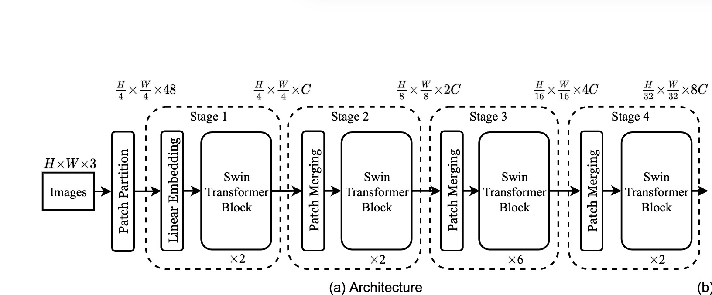

============
Build Swin Transformer with VFormer
============

In this tutorial, we will guide you to build Swin Transformer with the building blocks available in the library.

In general, many of vision transformers have 3 main building blocks,
1) Patch Embedding
2) Encoder
3) Decoder

Now let's look at Architecture of Swin Transformer

So  first step is that image is partitioned into patches and then projected into an embedding.

These patches can be overlapping or can be non-overlapping; There are different methods to extract these embeddings. Please see the embedding module for more insight.

.. code-block:: python
    import torch
    from vformer.encoder.embedding import PatchEmbedding

    patch_embedding = PatchEmbedding(
                              image_size = <insert size of an Image>,
                              patch_size = <insert size of a single patch>, #make sure that image_size is divisible by patch_size ,
                              in_channels = <insert number of input channels>, # for rgb image this value is 3; for grayscale this value is 1
                              embedding_dim = <insert number of dimensions of the embedding>, # every patch will be projected into the embedding space having `embedding_dim` dimensions
                              norm_layer = <normalisatopn layer object>
                              )

These embeddings are then encoded with Swin Encoder block. Swin Encoder block consists of Multi-Head-Self-Attention(MHSA) followed by Multi Layer Perceptron(MLP). I am not going in detail how the encoder is implemented;

importing swin Encoder

.. code-block:: python
    from vformer.encoder import SwinEncoder
    swin_encoder= nn.ModuleList()
    for i in range(<insert number of stages>):
        swin_encoder.append(
                dim=<Dimension of the embedding at ith stage>,
                input_resolution=<Resolution of patches at ith stage,
                depth=<Depth at ith stage>,
                num_heads=<Number of Attention heads at ith stage> ,
                window_size=<Insert window size>, # refert to window-self attention for more insight
                norm_layer=<Normalisation layer object>,
                downsample = <PatchMerging object > # in the last stage nn.Identity should be used
                )

This encodeded tensors are then passed through Decoder for classification

.. code-block:: python
    from vformer.decoder import MLPDecoder

    decoder = MLPDecoder(   config =<List of encoding dimensions>,
                         n_classes =<Number of classes> )
Now putting it all together

.. code-block:: python
    import torch
    import torch.nn as nn
    from vformer.encoder import SwinEncoder
    from vformer.encoder.embedding import PatchEmbedding
    from vformer.decoder import MLPDeocoder

    class SwinTransformer(nn.Module):
        def __init__(self,
                    img_size=224, patch_size=4, in_channels=3,
                    n_classes=10, embedding_dim=96, depths=[2, 2, 6, 2],
                    num_heads=[3, 6, 12, 24], window_size=7,
                    mlp_ratio=4.0, norm_layer=nn.LayerNorm,
                    decoder_config=[96,32,10], patch_norm=True,):
            super().__init__()
            self.patch_embed = PatchEmbedding(
                    img_size=img_size,
                    patch_size=patch_size,
                    in_channels=in_channels,
                    embedding_dim=embedding_dim,
                    norm_layer=norm_layer,
            )

            self.encoder = nn.ModuleList()

            for i_layer in range(len(depths)):
                layer = SwinEncoder(
                dim=int(embedding_dim * (2 ** i_layer)),
                input_resolution=(
                    (self.patch_resolution[0] // (2 ** i_layer)),
                    self.patch_resolution[1] // (2 ** i_layer),),
                depth=depths[i_layer],
                num_heads=num_heads[i_layer],
                window_size=window_size,
                mlp_ratio=mlp_ratio,
                norm_layer=norm_layer,
                downsample=PatchMerging if i_layer < len(depths) - 1 else None,
                )
                self.encoder.append(layer)

            self.decoder = MLPDecoder(config=decoder_config,n_classes)
        def forward(self,x):
            #forward pass

            x = self.patch_embed(x)
            x=self.encoder(x)
            return self.decoder(x)

    model = SwinTransformer()

Some popular Vision Transformer models are already implemented in VFormer, you can use them directly from vformer/models directory

for eg.

.. code-block:: python
    from vformer.models import SwinTransformer

    model = SwinTransformer(img_size = 224,patch_size=4,in_channels=3,window_size=7,n_classes=10)

